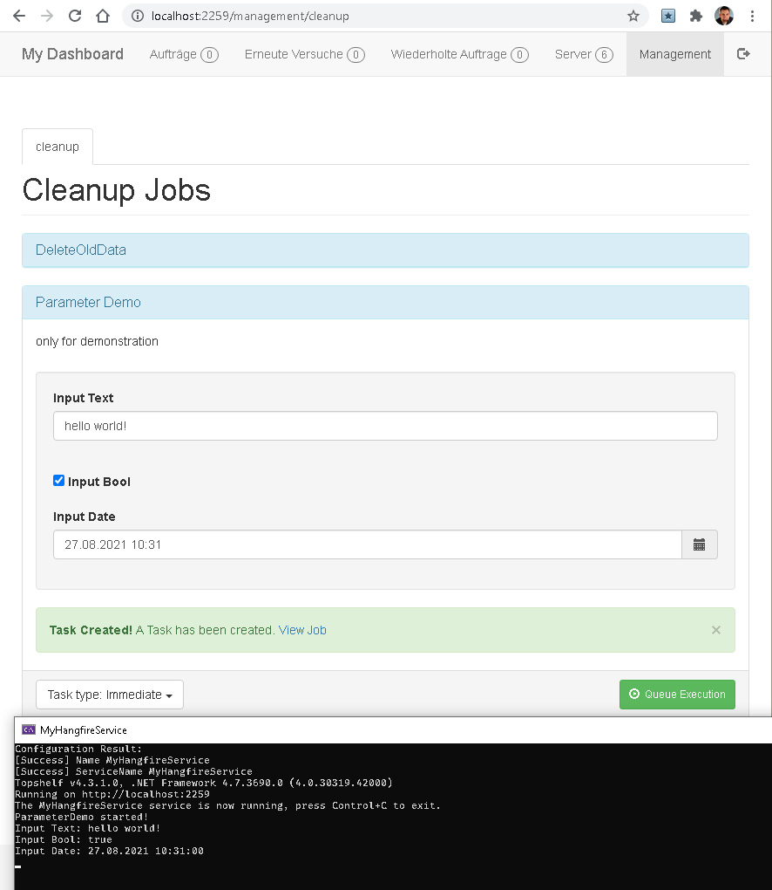

## Description

This Project demonstrates how to run Hangfire in a Windows Service with 
F# on .NET Framework.

Used Packages:
- Hangfire.Core
- Hangfire.SqlServer (for job persistence)
- Hangfire.Dashboard.Management.v2 (for the Management tab on the Dashboard)
- Microsoft.Owin.SelfHost (for web hosting in a console app / service)
- Newtonsoft.Json (current version needed for Management tab)
- Topshelf (for running as a windows service)

## Setup
* Create an empty Sql Server Database (I used 'HangfireDemo9' on SQL Express)
* Update the Connection String in MyOwinStartup.fs
* Have fun!

## Preview

